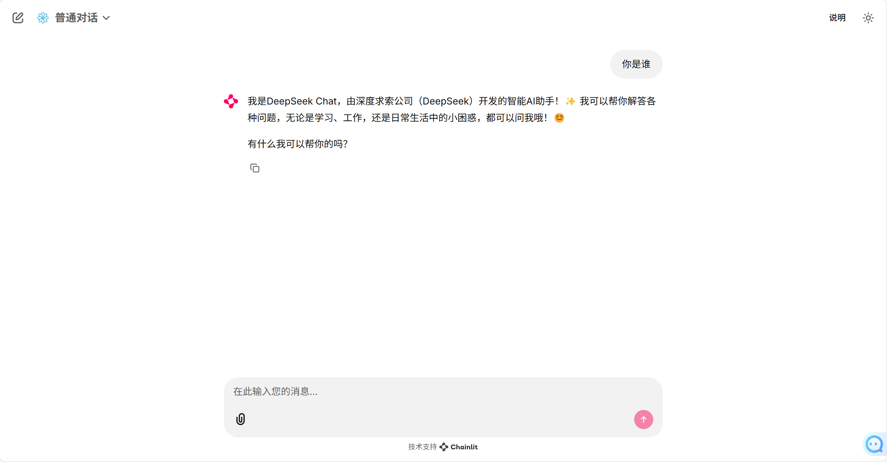
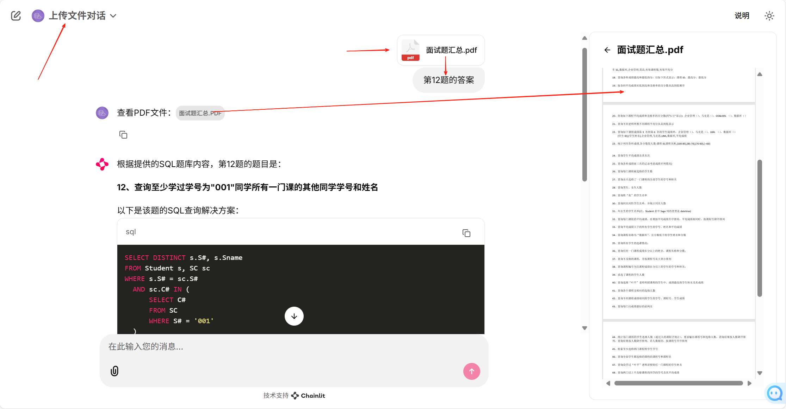

# FastRAG
---

---
#### 🔜 Round 1
😊 我能实现和大模型的对话啦

🤖 和大厂的模型聊天岂不是更香，看看deepseek、豆包、moonshot多厉害

😊 除了满足代码欲，还有其他的目的哦 🚀

---
#### 🔜 Round 2
😊 我可以支持上传文件聊天，对啦，支持几乎任意类型的文件哦：PDF、Markdown、Excel、Word、PPT、TXT、JSON、YAML、HTML、、、

🤖 线上对话大模型也可以做到这些

😊 如果你要上传的文件有安全要求，阁下如何应对哈

---
#### 🔜 Round 3
😊 我可以支持用自然语言和数据库对话了，不用再对公司日益增加的数据库数据而烦恼了，也给DBA减减负! 
让领导们随时可以获取想要的第一手数据；
当然测试小伙伴更可以去验证开发的sql是不是符合预期

🤖 这个可以有 .... 👍
